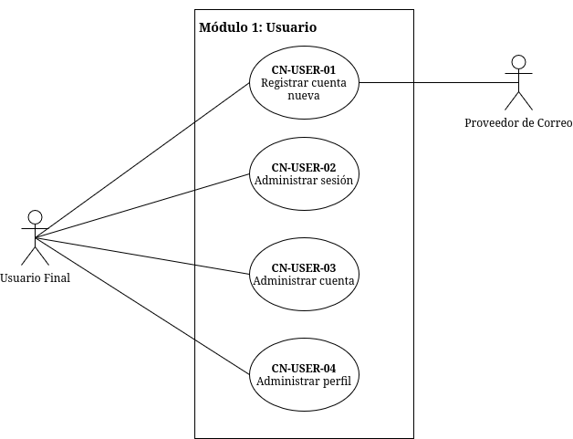
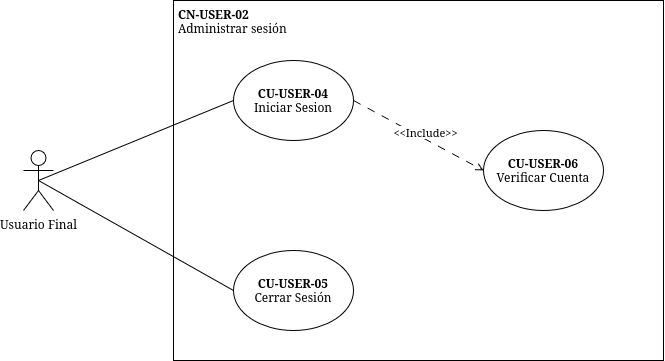
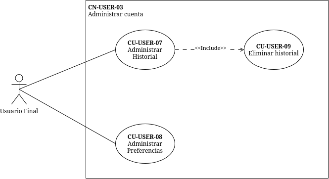
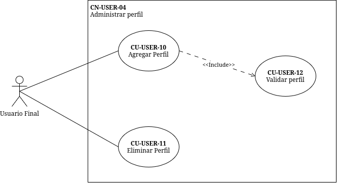
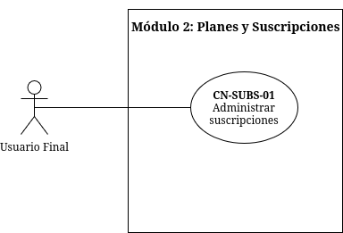

## CU-USER-01: Ingresar Datos

| Campo | Detalle |
|---|---|
| **Código** | CU-USER-01 |
| **Módulo** | Usuario / Autenticación |
| **Actor(es) principal(es)** | Usuario Final (Visitante) |
| **Actor(es) secundario(s)** | — |
| **Prioridad** | Alta |
| **Tipo** | Principal |
| **Precondiciones** | 1. El visitante ha accedido al formulario de registro de Quetzal TV. 2. El API Gateway está disponible y enruta hacia el microservicio de autenticación. |
| **Postcondiciones** | • **Éxito:** Los datos ingresados pasan al flujo de validación y el sistema mantiene la información en estado temporal (staging).< • **Fallo:** Se descartan los datos temporales; el sistema solicita corrección. |
| **Flujo Principal** | 1. El visitante accede a la opción "Crear cuenta".< 2. El sistema presenta el formulario de registro: correo electrónico, nombre completo, país de residencia y contraseña. 3. El visitante ingresa los datos solicitados. 4. El sistema ejecuta «include» **CU-USER-02: Validar Datos**. 5. El sistema almacena los datos validados en estado temporal. 6. El sistema ejecuta «include» **CU-USER-03: Notificar Registro**. 7. El sistema muestra mensaje de confirmación: "Revisa tu correo para verificar tu cuenta". |
| **Flujos Alternativos** | **FA-1: Registro federado (OAuth 2.0)**< 1. El visitante selecciona "Continuar con Google/GitHub".< 2. El sistema redirige al Identity Provider (OAuth).< 3. El Identity Provider retorna código de autorización. 4. El sistema intercambia el código por token de identidad. 5. El sistema extrae: email, nombre y avatar. 6. El sistema salta al paso 4 del flujo principal (Validar Datos) usando la información del IdP.  **FA-2: Autocompletar país por IP**< 1. El sistema detecta la IP del visitante. 2. Sugiere el país de residencia en el desplegable. 3. El visitante confirma o modifica la sugerencia; continúa en el paso 3. |
| **Flujos de Excepción** | **FE-1: Campos obligatorios vacíos**< 1. El visitante intenta continuar sin completar campos obligatorios. 2. El sistema resalta los campos faltantes y muestra: "Todos los campos son obligatorios".< 3. El flujo retorna al paso 2.  **FE-2: Formato de correo inválido**< 1. El visitante ingresa un correo sin formato válido. 2. El sistema muestra: "Ingresa un correo electrónico válido".< 3. El flujo retorna al paso 2. |
| **Reglas de Negocio** | • El correo electrónico debe ser único en la plataforma. • La contraseña debe tener mínimo 8 caracteres, 1 mayúscula, 1 minúscula, 1 número y 1 símbolo. • El país de residencia determina la moneda local por defecto en suscripciones. |
| **Requerimientos asociados** | • RF-AUTH-01 • RF-AUTH-05 (OAuth) • RNF-AUTH-01 (hash de credenciales) |

---

## CU-USER-02: Validar Datos

| Campo | Detalle |
|---|---|
| **Código** | CU-USER-02 |
| **Módulo** | Usuario / Autenticación |
| **Actor(es) principal(es)** | Sistema (Microservicio Auth) |
| **Actor(es) secundario(s)** | — |
| **Prioridad** | Alta |
| **Tipo** | Secundario (<<include>>) |
| **Precondiciones** | 1. El visitante ha ingresado datos en el formulario de registro o login. 2. El microservicio de autenticación está operativo. |
| **Postcondiciones** | • **Éxito:** Los datos cumplen todas las reglas de negocio; el flujo principal continúa. • **Fallo:** Se rechazan los datos; se notifica el motivo específico al usuario. |
| **Flujo Principal** | 1. El sistema recibe los datos ingresados por el actor principal o secundario. 2. El sistema verifica que el correo no exista previamente en la tabla de usuarios (consulta a DB).< 3. El sistema valida la fortaleza de la contraseña contra la política de seguridad. 4. El sistema verifica que el país seleccionado pertenezca a la lista de países operativos. 5. El sistema confirma la validación exitosa y retorna control al caso de uso invocador. |
| **Flujos Alternativos** | **FA-1: Validación en login (credenciales existentes)**< 1. El sistema recibe correo y contraseña de login. 2. Consulta el hash almacenado (bcrypt/Argon2).< 3. Compara la contraseña ingresada con el hash. 4. Si coinciden, retorna éxito; si no, lanza excepción de credenciales inválidas. |
| **Flujos de Excepción** | **FE-1: Correo ya registrado**< 1. La consulta a DB encuentra el correo activo. 2. El sistema retorna: "Este correo ya está asociado a una cuenta. ¿Deseas iniciar sesión?".< 3. El flujo se cancela.  **FE-2: Contraseña débil**< 1. La contraseña no cumple la política de complejidad. 2. El sistema muestra: "La contraseña debe contener al menos 8 caracteres, una mayúscula, una minúscula, un número y un símbolo".< 3. El flujo retorna al ingreso de datos.  **FE-3: Límite de intentos de validación**< 1. El visitante excede 5 intentos fallidos de validación en 15 minutos. 2. El sistema bloquea temporalmente la IP/cuenta por 15 minutos (RNF-AUTH-04). |
| **Reglas de Negocio** | • El correo electrónico es único e insensible a mayúsculas/minúsculas en la validación de duplicados. • La contraseña nunca se valida en texto plano contra una lista de contraseñas comunes (Have I Been Pwned opcional).< • La validación de existencia de correo debe responder en ≤ 100 ms (p95). |
| **Requerimientos asociados** | • RF-AUTH-01 • RNF-AUTH-01 (almacenamiento seguro) • RNF-AUTH-04 (rate limiting) |

---

## CU-USER-03: Notificar Registro

| Campo | Detalle |
|---|---|
| **Código** | CU-USER-03 |
| **Módulo** | Usuario / Notificaciones |
| **Actor(es) principal(es)** | Sistema (Microservicio Auth) |
| **Actor(es) secundario(s)** | Proveedor de Correo |
| **Prioridad** | Alta |
| **Tipo** | Secundario (<<include>>) |
| **Precondiciones** | 1. Los datos del usuario han sido validados exitosamente. 2. El microservicio de notificaciones o el adaptador SMTP está configurado. |
| **Postcondiciones** | • **Éxito:** El correo de confirmación/verificación ha sido encolado o enviado; se registra el intento de envío. • **Fallo:** Se registra el fallo en logs; la cuenta queda en estado "pendiente de verificación" pero los datos persisten. |
| **Flujo Principal** | 1. El sistema genera un token de verificación único (UUID/JWT de un solo uso con TTL de 24 horas).< 2. El sistema construye el correo electrónico con enlace de verificación: `https://quetzal.tv/verify?token=<token>`.< 3. El sistema invoca al **Proveedor de Correo** mediante API interna (gRPC o HTTP) para el despacho. 4. El Proveedor de Correo acepta la petición y retorna código 202/200. 5. El sistema almacena el token de verificación asociado al usuario en DB con estado "pendiente". |
| **Flujos Alternativos** | **FA-1: Reenvío de notificación**< 1. El usuario solicita "Reenviar correo de confirmación" desde la pantalla de espera. 2. El sistema invalida el token anterior. 3. El sistema genera un nuevo token y repite el flujo principal desde el paso 2.  **FA-2: Notificación de recibo (post-compra)**< 1. Este mismo caso de uso puede ser invocado por **CU-SUBS-02-01** (Contratar plan) para enviar el recibo de compra. |
| **Flujos de Excepción** | **FE-1: Proveedor de Correo no disponible**< 1. La petición al Proveedor de Correo falla o excede timeout. 2. El sistema encola el mensaje en una cola de reintentos (si aplica arquitectura asíncrona) o registra el fallo. 3. El sistema muestra al usuario: "Tu cuenta fue creada. Reenviaremos el correo de confirmación en unos minutos".<  **FE-2: Dirección de correo rechazada (bounce)**< 1. El Proveedor de Correo reporta dirección inexistente. 2. El sistema marca la cuenta como "correo inválido" y solicita actualización de email en el próximo login. |
| **Reglas de Negocio** | • El token de verificación expira en 24 horas. • El enlace de verificación debe ser de un solo uso; una vez consumido, se invalida. • El correo debe incluir branding de Quetzal TV y opción de contacto a soporte. |
| **Requerimientos asociados** | • RF-AUTH-01 (registro) • RF-SUBS (recibos) • RNF-PORT-01 (configuración por .env del SMTP) |

---

## CU-USER-04: Iniciar Sesión

| Campo | Detalle |
|---|---|
| **Código** | CU-USER-04 |
| **Módulo** | Usuario / Autenticación |
| **Actor(es) principal(es)** | Usuario Final |
| **Actor(es) secundario(s)** | — |
| **Prioridad** | Alta |
| **Tipo** | Principal |
| **Precondiciones** | 1. El usuario posee una cuenta registrada y verificada. 2. El microservicio de autenticación y el API Gateway están operativos. |
| **Postcondiciones** | • **Éxito:** El usuario obtiene JWT válido, Session Cookie segura y acceso al panel de perfiles. • **Fallo:** No se genera sesión; se incrementa contador de intentos fallidos. |
| **Flujo Principal** | 1. El usuario ingresa correo y contraseña en el formulario de login. 2. El sistema ejecuta «include» **CU-USER-02: Validar Datos** (validación de credenciales contra hash).< 3. El sistema genera un **Access Token** (JWT RS256, exp 15 min) con claims: `sub`, `email`, `roles`, `iat`, `exp`, `jti`.< 4. El sistema genera un **Refresh Token** (exp 7 días) y lo almacena de forma segura. 5. El sistema establece la **Session Cookie** segura (`HttpOnly`, `Secure`, `SameSite=Strict`, `Path=/`).< 6. El sistema registra el evento de login en la tabla de auditoría (IP, timestamp, user agent).< 7. El sistema redirige al usuario al selector de perfiles. |
| **Flujos Alternativos** | **FA-1: Inicio de sesión con OAuth 2.0**< 1. El usuario selecciona "Continuar con [Proveedor]".< 2. El sistema redirige al Authorization Endpoint del Identity Provider con `state` y `nonce`.< 3. El Identity Provider retorna código de autorización al callback de Quetzal TV. 4. El sistema valida el `state` para prevenir CSRF. 5. El sistema intercambia el código por `id_token` y valida la firma contra JWKS. 6. Si el usuario no existe, se crea cuenta vinculada; si existe, se vincula sesión. 7. Continúa en el paso 3 del flujo principal.  **FA-2: Recuerdame (Remember Me)**< 1. El usuario marca la opción "Mantener sesión iniciada".< 2. El sistema extiende la duración de la Session Cookie a 30 días. 3. El Refresh Token se extiende proporcionalmente. |
| **Flujos de Excepción** | **FE-1: Credenciales inválidas**< 1. La validación de datos falla (correo no existe o contraseña no coincide).< 2. El sistema incrementa el contador de intentos fallidos. 3. Si el contador < 5, muestra: "Correo o contraseña incorrectos".< 4. Si el contador ≥ 5, aplica bloqueo temporal de 15 minutos (RNF-AUTH-04).<  **FE-2: Cuenta no verificada**< 1. El usuario existe pero el estado es "pendiente de verificación".< 2. El sistema muestra: "Verifica tu correo antes de iniciar sesión" y ofrece reenvío de correo.  **FE-3: Cuenta cancelada/inactiva**< 1. El usuario existe pero su estado es `inactive` o `banned`.< 2. El sistema muestra: "Tu cuenta no está disponible. Contacta a soporte". |
| **Reglas de Negocio** | • El JWT access token expira en 15 minutos; el refresh token en 7 días. • La Session Cookie debe incluir `HttpOnly`, `Secure` (en producción) y `SameSite=Strict`.< • Cada login exitoso genera un `jti` único para trazabilidad. • La comunicación service-to-service debe propagar el JWT en el header `Authorization: Bearer`. |
| **Requerimientos asociados** | • RF-AUTH-02 • RF-AUTH-03 (JWT service-to-service) • RF-AUTH-04 (Session Cookies) • RNF-AUTH-02 (RS256, expiraciones) • RNF-AUTH-03 (flags de cookie) • RNF-AUTH-04 (rate limiting) |

---

## CU-USER-05: Cerrar Sesión

| Campo | Detalle |
|---|---|
| **Código** | CU-USER-05 |
| **Módulo** | Usuario / Autenticación |
| **Actor(es) principal(es)** | Usuario Final |
| **Actor(es) secundario(s)** | — |
| **Prioridad** | Media |
| **Tipo** | Principal |
| **Precondiciones** | 1. El usuario tiene una sesión activa (JWT válido y Session Cookie presente).< 2. El API Gateway ha validado la cookie/JWT en la petición. |
| **Postcondiciones** | • **Éxito:** El JWT queda invalidado (denylist), la cookie se destruye y la sesión del cliente finaliza. • **Fallo:** La sesión del cliente puede quedar parcialmente activa; se registra anomalía. |
| **Flujo Principal** | 1. El usuario selecciona "Cerrar sesión" en la interfaz. 2. El API Gateway intercepta la petición y extrae el JWT de la cookie. 3. El sistema envía el `jti` del JWT a una lista de denegación (Redis/DB) con TTL igual al tiempo restante de expiración del token. 4. El sistema destruye la Session Cookie del cliente (set cookie con `Max-Age=0` y valores vacíos).< 5. El sistema registra el evento de logout en auditoría. 6. El sistema redirige al usuario a la página de login. |
| **Flujos Alternativos** | **FA-1: Cierre de sesión remota (todas las sesiones)**< 1. Desde el panel de administración de cuenta, el usuario selecciona "Cerrar sesión en todos los dispositivos".< 2. El sistema invalida todos los refresh tokens activos del usuario. 3. El sistema agrega todos los JWT activos a la denylist. 4. Se destruyen todas las cookies asociadas en los clientes en su próxima petición.  **FA-2: Cierre automático por expiración**< 1. El JWT access token expira tras 15 minutos de inactividad. 2. El sistema rechaza la petición con 401. 3. El cliente debe usar el refresh token para renovar; si también expiró, se fuerza logout implícito. |
| **Flujos de Excepción** | **FE-1: Token ya invalidado**< 1. El sistema detecta que el `jti` ya existe en la denylist. 2. El sistema destruye la cookie de todas formas y redirige a login. 3. Se registra como posible reutilización de token (alerta de seguridad opcional).<  **FE-2: Fallo de conexión a Redis (denylist)**< 1. El microservicio no puede contactar Redis para almacenar la invalidación. 2. El sistema recurre a invalidación por rotación de secret de firma (emergencia) o almacena en DB. 3. Se dispara alerta al equipo de operaciones. |
| **Reglas de Negocio** | • Un JWT invalidado debe rechazarse en todas las peticiones posteriores, incluso si aún no ha expirado técnicamente. • La cookie debe eliminarse tanto en el cliente como en el registro del servidor. • El cierre de sesión debe ser idempotente (múltiples clicks no generan error). |
| **Requerimientos asociados** | • RF-AUTH-06 (logout seguro) • RNF-AUTH-02 (invalidación JWT) • RF-AUTH-03 (propagación de identidad) |

---

## CU-USER-06: Verificar Cuenta

| Campo | Detalle |
|---|---|
| **Código** | CU-USER-06 |
| **Módulo** | Usuario / Autenticación |
| **Actor(es) principal(es)** | Usuario Final |
| **Actor(es) secundario(s)** | — |
| **Prioridad** | Alta |
| **Tipo** | Principal |
| **Precondiciones** | 1. El usuario ha completado el registro (CU-USER-01).< 2. El usuario ha recibido el correo con el enlace de verificación (CU-USER-03).< 3. El token de verificación no ha expirado. |
| **Postcondiciones** | • **Éxito:** La cuenta cambia de estado "pendiente" a "activa"; el usuario puede iniciar sesión. • **Fallo:** La cuenta permanece en estado "pendiente"; se ofrece reenvío de correo. |
| **Flujo Principal** | 1. El usuario accede al enlace de verificación desde su correo electrónico. 2. El API Gateway recibe la petición GET con el parámetro `token`.< 3. El microservicio de autenticación valida el token contra la — (existencia y no expiración).< 4. El sistema actualiza el estado de la cuenta a `active`.< 5. El sistema invalida el token de verificación (eliminación lógica o física).< 6. El sistema muestra pantalla de éxito: "Cuenta verificada. Ahora puedes iniciar sesión". |
| **Flujos Alternativos** | **FA-1: Verificación desde móvil con deep link**< 1. El usuario abre el enlace desde la app móvil. 2. El sistema intercepta el deep link y extrae el token. 3. El flujo continúa desde el paso 3. |
| **Flujos de Excepción** | **FE-1: Token expirado**< 1. El sistema detecta que el token excedió las 24 horas de vigencia. 2. El sistema muestra: "El enlace ha expirado. Solicita uno nuevo".< 3. El sistema ofrece botón para reejecutar CU-USER-03 (Notificar Registro).<  **FE-2: Token inválido o ya consumido**< 1. El token no existe en la — o ya fue marcado como usado. 2. El sistema muestra: "Enlace no válido. Verifica tu correo o contacta a soporte".<  **FE-3: Cuenta ya verificada**< 1. El token es válido pero la cuenta ya está en estado `active`.< 2. El sistema muestra: "Tu cuenta ya está verificada" y ofrece redirección a login. |
| **Reglas de Negocio** | • El token de verificación es de un solo uso; una vez consumido, se invalida permanentemente. • La verificación es obligatoria para iniciar sesión por primera vez. • El estado de la cuenta debe ser atómico (`pending` → `active`); no se permiten estados intermedios. |
| **Requerimientos asociados** | • RF-AUTH-01 (registro completo) • RNF-AUTH-02 (tokens con TTL) |

---

## CU-USER-07: Administrar Historial

| Campo | Detalle |
|---|---|
| **Código** | CU-USER-07 |
| **Módulo** | Usuario / Administración de Cuenta |
| **Actor(es) principal(es)** | Usuario Final |
| **Actor(es) secundario(s)** | — |
| **Prioridad** | Media |
| **Tipo** | Principal |
| **Precondiciones** | 1. El usuario ha iniciado sesión (CU-USER-04).< 2. El usuario accede al panel de "Seguridad y Privacidad" de su cuenta. |
| **Postcondiciones** | • **Éxito:** El usuario visualiza el historial de actividad de su cuenta. • **Fallo:** Se muestra mensaje de error y no se expone información. |
| **Flujo Principal** | 1. El usuario accede a la opción "Historial de actividad" dentro del panel de administración. 2. El sistema consulta la tabla de auditoría (alimentada por triggers y logs de sesión).< 3. El sistema presenta la lista cronológica: inicios de sesión, cambios de contraseña, cambios de correo, contrataciones de plan, modificaciones de suscripción. 4. El usuario puede filtrar por tipo de evento y rango de fechas. 5. El usuario selecciona un evento para ver detalle (IP, dispositivo, timestamp). |
| **Flujos Alternativos** | **FA-1: Exportar historial**< 1. El usuario selecciona "Exportar".< 2. El sistema genera archivo CSV/JSON con los eventos filtrados. 3. El sistema inicia descarga del archivo. |
| **Flujos de Excepción** | **FE-1: Sin eventos registrados**< 1. La consulta retorna conjunto vacío. 2. El sistema muestra: "No hay actividad reciente en tu cuenta".<  **FE-2: Fallo de consulta a DB**< 1. La tabla de auditoría no responde. 2. El sistema muestra: "No fue posible cargar tu historial. Intenta más tarde". |
| **Reglas de Negocio** | • El historial debe mostrar los últimos 90 días por defecto; máximo 2 años disponibles. • Los eventos de cambio de credenciales deben mostrar el timestamp exacto y la IP de origen. • El usuario solo puede ver su propio historial (aislamiento por `sub` del JWT). |
| **Requerimientos asociados** | • RF-ADMIN-02 (panel de cuenta) • RF-DB-02 (trigger de auditoría) • RNF-AUTH-02 (trazabilidad JWT `jti`) |

---

## CU-USER-08: Administrar Preferencias

| Campo | Detalle |
|---|---|
| **Código** | CU-USER-08 |
| **Módulo** | Usuario / Administración de Cuenta |
| **Actor(es) principal(es)** | Usuario Final |
| **Actor(es) secundario(s)** | — |
| **Prioridad** | Media |
| **Tipo** | Principal |
| **Precondiciones** | 1. El usuario ha iniciado sesión. 2. El usuario accede al panel de "Configuración de cuenta". |
| **Postcondiciones** | • **Éxito:** Las preferencias se actualizan y aplican inmediatamente a la cuenta. • **Fallo:** Las preferencias previas se mantienen; se notifica el error. |
| **Flujo Principal** | 1. El usuario accede a "Preferencias de cuenta".< 2. El sistema muestra las opciones configurables: idioma de la plataforma, país de facturación, preferencias de notificación por correo (marketing, nuevos lanzamientos, recibos), moneda de visualización preferida. 3. El usuario modifica una o varias preferencias. 4. El usuario confirma los cambios. 5. El sistema valida que el país seleccionado esté en la lista de países operativos. 6. El sistema almacena las preferencias en la —. 7. El sistema confirma: "Preferencias actualizadas correctamente". |
| **Flujos Alternativos** | **FA-1: Cambio de país con impacto en moneda**< 1. El usuario cambia el país de residencia/facturación. 2. El sistema ejecuta «include» consulta a FX-Service para mostrar precios en la nueva moneda. 3. El sistema advierte: "Los precios de tu suscripción se mostrarán en [nueva moneda]". |
| **Flujos de Excepción** | **FE-1: País no operativo**< 1. El país seleccionado no está en la lista de mercados activos de Quetzal TV. 2. El sistema muestra: "Quetzal TV aún no está disponible en este país".< 3. El sistema descarta el cambio y mantiene el país anterior.  **FE-2: Fallo de actualización**< 1. La escritura en DB falla. 2. El sistema muestra: "No se pudieron guardar los cambios. Intenta nuevamente". |
| **Reglas de Negocio** | • El idioma por defecto se deriva del país seleccionado durante el registro, pero el usuario puede sobrescribirlo. • Las preferencias de notificación marketing deben respetar el opt-in/opt-out (cumplimiento normativo).< • El cambio de país puede requerir re-verificación de método de pago si hay suscripción activa. |
| **Requerimientos asociados** | • RF-ADMIN-01 (panel de administración) • RNF-PORT-01 (configuración por entorno) |

---

## CU-USER-09: Eliminar Historial

| Campo | Detalle |
|---|---|
| **Código** | CU-USER-09 |
| **Módulo** | Usuario / Administración de Cuenta |
| **Actor(es) principal(es)** | Usuario Final |
| **Actor(es) secundario(s)** | — |
| **Prioridad** | Baja |
| **Tipo** | Principal |
| **Precondiciones** | 1. El usuario ha iniciado sesión. 2. El usuario tiene al menos un evento en su historial de actividad (CU-USER-07). |
| **Postcondiciones** | • **Éxito:** Los eventos seleccionados se eliminan de la vista del usuario (soft delete o anonimización según política).< • **Fallo:** El historial permanece intacto. |
| **Flujo Principal** | 1. El usuario accede a "Historial de actividad" (CU-USER-07).< 2. El usuario selecciona uno o varios eventos del historial. 3. El usuario selecciona "Eliminar seleccionados".< 4. El sistema solicita confirmación: "¿Estás seguro? Esta acción no se puede deshacer".< 5. El usuario confirma. 6. El sistema marca los registros como `deleted_by_user = true` (soft delete para cumplimiento normativo).< 7. El sistema refresca la vista y muestra: "Historial eliminado". |
| **Flujos Alternativos** | **FA-1: Eliminar todo el historial**< 1. El usuario selecciona "Eliminar todo mi historial de actividad".< 2. El sistema solicita re-autenticación (CU-USER-04 con contraseña actual).< 3. Al confirmar, se marcan todos los eventos del usuario como eliminados por solicitud del titular. |
| **Flujos de Excepción** | **FE-1: Eventos de auditoría obligatorios**< 1. El usuario intenta eliminar eventos que son de cumplimiento legal (cambios de credenciales, compras).< 2. El sistema muestra: "Algunos eventos no pueden eliminarse por requerimientos de auditoría".< 3. El sistema elimina solo los eventos permitidos y notifica cuáles fueron retenidos.  **FE-2: Fallo de actualización masiva**< 1. La transacción de soft delete falla a mitad de proceso. 2. El sistema realiza rollback total. 3. Se muestra: "No se pudo completar la eliminación. Intenta nuevamente". |
| **Reglas de Negocio** | • Los eventos de compra y cambio de credenciales deben conservarse en backend por 5 años para auditoría, aunque el usuario los elimine de su vista (anonimización parcial).< • La eliminación requiere confirmación explícita para prevenir borrado accidental. • La acción de eliminar todo requiere re-autenticación por seguridad. |
| **Requerimientos asociados** | • RF-ADMIN-02 (gestión de cuenta) • RF-DB-02 (auditoría y retención) • RNF-AUTH-01 (protección de datos) |

---

## CU-USER-10: Agregar Perfil

| Campo | Detalle |
|---|---|
| **Código** | CU-USER-10 |
| **Módulo** | Usuario / Perfiles |
| **Actor(es) principal(es)** | Usuario Final (Administrador de la cuenta) |
| **Actor(es) secundario(s)** | — |
| **Prioridad** | Alta |
| **Tipo** | Principal |
| **Precondiciones** | 1. El usuario ha iniciado sesión (CU-USER-04).< 2. La cuenta tiene menos de 5 perfiles activos. 3. El usuario se encuentra en la pantalla de selección/gestión de perfiles. |
| **Postcondiciones** | • **Éxito:** El nuevo perfil queda creado, asociado a la cuenta y disponible para selección. • **Fallo:** No se crea el perfil; se mantiene el estado anterior. |
| **Flujo Principal** | 1. El usuario selecciona "Agregar perfil".< 2. El sistema presenta el formulario: nombre del perfil, avatar/imagen (opcional), clasificación por edades (todos los públicos, 7+, 13+, 18+).< 3. El usuario ingresa la información. 4. El sistema ejecuta «include» **CU-USER-12: Validar Perfil**. 5. El sistema almacena el perfil en la — con `account_id` y `profile_id` único. 6. El sistema muestra el nuevo perfil en la grilla de selección. 7. El sistema ofrece seleccionar el perfil recién creado para iniciar navegación. |
| **Flujos Alternativos** | **FA-1: Avatar por defecto**< 1. El usuario no selecciona avatar. 2. El sistema asigna un avatar generado automáticamente basado en las iniciales del nombre o un ícono aleatorio de la biblioteca.  **FA-2: Perfil infantil (restricciones)**< 1. El usuario selecciona clasificación "7+" o perfil infantil. 2. El sistema activa automáticamente controles parentales: bloqueo de contenido +18, desactivación de calificaciones públicas. 3. El flujo continúa en el paso 4. |
| **Flujos de Excepción** | **FE-1: Límite de 5 perfiles alcanzado**< 1. La validación detecta que la cuenta ya posee 5 perfiles activos. 2. El sistema muestra: "Has alcanzado el límite máximo de 5 perfiles. Elimina uno para continuar".< 3. Se deshabilita el botón "Agregar perfil".<  **FE-2: Nombre duplicado dentro de la cuenta**< 1. Ya existe un perfil con el mismo nombre en la cuenta. 2. El sistema sugiere: "Ya existe un perfil con este nombre. Usa un nombre diferente".<  **FE-3: Fallo de almacenamiento**< 1. La — no responde durante la inserción. 2. El sistema muestra: "No se pudo crear el perfil. Intenta nuevamente". |
| **Reglas de Negocio** | • Máximo 5 perfiles por cuenta; el límite es rígido e innegociable. • El nombre del perfil debe tener entre 1 y 50 caracteres alfanuméricos. • Cada perfil debe tener un identificador único (`profile_id`) aislado del `user_id` de la cuenta. • El perfil principal (owner) se crea automáticamente al registrar la cuenta y no cuenta para el límite de 5 (o sí, según diseño del grupo; aquí asumo que los 5 incluyen el principal). |
| **Requerimientos asociados** | • RF-PROF-01 (máximo 5 perfiles) • RF-PROF-02 (aislamiento) • RF-PROF-03 (nombre, avatar, clasificación) |

---

## CU-USER-11: Eliminar Perfil

| Campo | Detalle |
|---|---|
| **Código** | CU-USER-11 |
| **Módulo** | Usuario / Perfiles |
| **Actor(es) principal(es)** | Usuario Final (Administrador de la cuenta) |
| **Actor(es) secundario(s)** | — |
| **Prioridad** | Media |
| **Tipo** | Principal |
| **Precondiciones** | 1. El usuario ha iniciado sesión. 2. La cuenta tiene al menos 2 perfiles (uno principal + al menos uno secundario).< 3. El usuario se encuentra en la gestión de perfiles. |
| **Postcondiciones** | • **Éxito:** El perfil secundario queda eliminado junto con sus datos asociados (historial, preferencias).< • **Fallo:** El perfil permanece activo. |
| **Flujo Principal** | 1. El usuario selecciona el perfil secundario que desea eliminar. 2. El usuario selecciona la opción "Eliminar perfil".< 3. El sistema valida que el perfil no sea el perfil principal (owner).< 4. El sistema muestra advertencia: "Se eliminarán todas las preferencias y progreso asociados a [Nombre del perfil]. ¿Continuar?".< 5. El usuario confirma. 6. El sistema ejecuta eliminación en cascada: perfil → preferencias → historial de reproducción del perfil (delegado al microservicio correspondiente vía gRPC si aplica).< 7. El sistema actualiza el contador de perfiles de la cuenta. 8. El sistema redirige a la grilla de perfiles actualizada. |
| **Flujos Alternativos** | **FA-1: Transferir datos antes de eliminar**< 1. El sistema ofrece opción "Transferir historial a otro perfil" antes de confirmar. 2. El usuario selecciona perfil destino. 3. El sistema migra los datos y luego ejecuta la eliminación.  **FA-2: Eliminación desde panel admin (autogestión)**< 1. El usuario accede a "Administrar perfiles" dentro del panel de cuenta. 2. El flujo continúa desde el paso 1. |
| **Flujos de Excepción** | **FE-1: Perfil principal protegido**< 1. El usuario intenta eliminar el perfil principal (owner).< 2. El sistema muestra: "No puedes eliminar el perfil principal. Para eliminarlo, debes cancelar tu cuenta".< 3. Se cancela la operación.  **FE-2: Perfil con sesión activa**< 1. El perfil seleccionado tiene una sesión de reproducción activa en otro dispositivo. 2. El sistema fuerza el cierre de esa sesión y luego procede a eliminar.  **FE-3: Fallo de eliminación en cascada**< 1. La transacción de eliminación falla a mitad de proceso. 2. El sistema realiza rollback total. 3. Se muestra: "No se pudo eliminar el perfil. Intenta nuevamente". |
| **Reglas de Negocio** | • El perfil principal (owner) es indeleble mientras la cuenta exista. • La eliminación de perfil debe ser atómica: o se elimina todo el árbol de datos del perfil, o no se elimina nada. • Se debe conservar un registro de auditoría de la eliminación (quién, cuándo, qué perfil) por 1 año. |
| **Requerimientos asociados** | • RF-PROF-01 (límite 5) • RF-PROF-04 (eliminar perfil secundario) • RF-DB-02 (auditoría) |

---

## CU-USER-12: Validar Perfil

| Campo | Detalle |
|---|---|
| **Código** | CU-USER-12 |
| **Módulo** | Usuario / Perfiles |
| **Actor(es) principal(es)** | Sistema (Microservicio Auth/Perfiles) |
| **Actor(es) secundario(s)** | — |
| **Prioridad** | Alta |
| **Tipo** | Secundario (<<include>>) |
| **Precondiciones** | 1. El usuario ha solicitado crear (CU-USER-10) o editar un perfil. 2. El microservicio de perfiles está operativo. |
| **Postcondiciones** | • **Éxito:** Los datos del perfil cumplen todas las reglas de negocio; el flujo invocador continúa. • **Fallo:** Se rechaza la operación; se notifican los errores específicos. |
| **Flujo Principal** | 1. El sistema recibe los datos del perfil: nombre, avatar, clasificación por edades. 2. El sistema verifica que la cuenta no exceda el límite de 5 perfiles activos (consulta a DB).< 3. El sistema valida que el nombre tenga entre 1 y 50 caracteres y no contenga palabras reservadas/ofensivas. 4. El sistema valida que el avatar, si se proporcionó, sea una imagen válida (formatos: JPG, PNG; tamaño máx. 2 MB).< 5. El sistema valida que la clasificación por edades sea un valor permitido del enum: `all`, `7+`, `13+`, `18+`.< 6. El sistema confirma validación exitosa y retorna control al caso de uso invocador. |
| **Flujos Alternativos** | **FA-1: Validación en edición de perfil existente**< 1. El sistema detecta que es una edición, no creación. 2. Omite la validación de límite de 5 perfiles (paso 2).< 3. Valida que el `profile_id` pertenezca a la cuenta del usuario autenticado. 4. Continúa desde el paso 3. |
| **Flujos de Excepción** | **FE-1: Límite de perfiles excedido**< 1. La cuenta ya tiene 5 perfiles. 2. El sistema retorna error: "Límite de perfiles alcanzado".< 3. El flujo invocador (CU-USER-10) muestra el mensaje al usuario.  **FE-2: Nombre inválido**< 1. El nombre está vacío, excede 50 caracteres o contiene términos prohibidos. 2. El sistema retorna: "El nombre del perfil no es válido".<  **FE-3: Formato de avatar no soportado**< 1. El archivo no es JPG/PNG o excede 2 MB. 2. El sistema retorna: "Selecciona una imagen JPG o PNG de máximo 2 MB". |
| **Reglas de Negocio** | • El límite de 5 perfiles es rígido por cuenta. • Los nombres de perfil deben ser únicos dentro de una misma cuenta. • La clasificación por edades determina los filtros de contenido aplicados al perfil. • La validación debe completarse en ≤ 200 ms para no degradar la experiencia. |
| **Requerimientos asociados** | • RF-PROF-01 (máximo 5) • RF-PROF-03 (clasificación, avatar) • RNF-PERF-01 (tiempo de respuesta) |

---

## CU-SUBS-01: Visualizar Planes

| Campo | Detalle |
|---|---|
| **Código** | CU-SUBS-01 |
| **Módulo** | Planes y Suscripciones |
| **Actor(es) principal(es)** | Usuario Final |
| **Actor(es) secundario(s)** | Proveedor Fx (vía FX-Service con Redis Cache) |
| **Prioridad** | Alta |
| **Tipo** | Principal |
| **Precondiciones** | 1. El usuario ha iniciado sesión (CU-USER-04) o navega como visitante con acceso público a la landing de planes. 2. El microservicio de suscripciones está operativo y registrado en el API Gateway. 3. El FX-Service tiene al menos una tasa de cambio cacheada o puede consultar al proveedor externo. |
| **Postcondiciones** | • **Éxito:** El usuario visualiza los planes disponibles con precios en su moneda local y características diferenciadas. • **Fallo:** Se muestra mensaje de error; no se expone información de precios inconsistente. |
| **Flujo Principal** | 1. El usuario accede a la sección "Planes y Precios" desde el menú principal o el panel de cuenta. 2. El sistema identifica el país/moneda preferida del usuario (desde preferencias de cuenta o detección por IP). 3. El sistema ejecuta «include» **CU-SUBS-03: Mostrar Planes**. 4. El sistema ejecuta «include» **CU-SUBS-04: Seleccionar Suscripción** (presenta la interfaz de selección junto a la visualización). 5. El sistema consulta el FX-Service para obtener el tipo de cambio USD → moneda local (cache Redis, TTL 1 hora). 6. El sistema renderiza las tarjetas de planes: Básico, Estándar y Premium, mostrando nombre, precio local, resolución máxima, número de dispositivos simultáneos y funciones incluidas. 7. El usuario visualiza la comparativa completa. |
| **Flujos Alternativos** | **FA-1: Visualización sin sesión iniciada** 1. El visitante accede a "/planes" sin autenticación. 2. El sistema detecta ausencia de JWT/cookie. 3. El sistema usa moneda por defecto (USD) o detecta país por IP. 4. El flujo continúa desde el paso 3, pero el botón de "Contratar" redirige a registro (CU-USER-01).  **FA-2: Usuario con suscripción activa** 1. El sistema detecta que el usuario ya tiene un plan activo. 2. Destaca el plan actual con etiqueta "Plan actual" y muestra opciones de upgrade/downgrade. |
| **Flujos de Excepción** | **FE-1: FX-Service no disponible** 1. El FX-Service no responde y no hay cache válido en Redis. 2. El sistema muestra precios en USD con indicador: "Precios en dólares. Actualizaremos tu moneda local en breve". 3. Se registra el fallo para monitoreo.  **FE-2: No hay planes configurados** 1. La — de suscripciones retorna conjunto vacío. 2. El sistema muestra: "No hay planes disponibles en este momento". 3. Se dispara alerta al equipo de operaciones.  **FE-3: Timeout en consulta a Redis** 1. El cache de Redis no responde. 2. El sistema consulta directamente al FX-Service o muestra USD como fallback. 3. Se registra degradación de servicio. |
| **Reglas de Negocio** | • Los planes siempre se muestran en el orden: Básico → Estándar → Premium. • El precio en moneda local se calcula como: `precio_usd * tasa_cambio` y se redondea a 2 decimales. • Si el cache de la tasa de cambio tiene > 1 hora, se debe refrescar en background. • El plan Básico debe indicar explícitamente si incluye publicidad. |
| **Requerimientos asociados** | • RF-SUBS-01 (visualización de planes) • RF-SUBS-03 (consulta FX-Service) • RNF-PERF-02 (respuesta ≤ 200 ms con cache) |

---

## CU-SUBS-02: Administrar Credenciales

| Campo | Detalle |
|---|---|
| **Código** | CU-SUBS-02 |
| **Módulo** | Planes y Suscripciones / Administración de Cuenta |
| **Actor(es) principal(es)** | Usuario Final |
| **Actor(es) secundario(s)** | Proveedor de Pasarela de Pago (externo) |
| **Prioridad** | Media |
| **Tipo** | Principal (<<extend>> de CU-SUBS-01) |
| **Precondiciones** | 1. El usuario está visualizando los planes (CU-SUBS-01) o se encuentra en el panel de administración de cuenta. 2. El usuario tiene una sesión activa válida. 3. El sistema requiere credenciales de pago actualizadas antes de permitir una contratación o renovación. |
| **Postcondiciones** | • **Éxito:** Las credenciales de pago (método de pago, facturación) quedan actualizadas y validadas por la pasarela. • **Fallo:** Las credenciales previas se mantienen; se notifica el error sin almacenar datos sensibles inválidos. |
| **Flujo Principal** | 1. Desde la vista de planes, el usuario selecciona "Actualizar método de pago" (punto de extensión desde CU-SUBS-01). 2. El sistema presenta el formulario: nombre del titular, número de tarjeta/token, fecha de expiración, CVV, dirección de facturación. 3. El usuario ingresa o modifica los datos. 4. El sistema valida el formato de los datos (Luhn para tarjeta, fecha futura). 5. El sistema envía los datos de forma segura (TLS 1.3) a la pasarela de pago para tokenización. 6. La pasarela retorna un token de método de pago (nunca se almacena PAN completo en Quetzal TV). 7. El sistema almacena el token y los últimos 4 dígitos de la tarjeta para referencia. 8. El sistema confirma: "Método de pago actualizado correctamente". |
| **Flujos Alternativos** | **FA-1: Agregar método de pago alternativo** 1. El usuario selecciona "Agregar otro método de pago". 2. El sistema permite registrar un segundo método y marcar uno como predeterminado. 3. El flujo continúa desde el paso 4.  **FA-2: Eliminar método de pago** 1. El usuario selecciona eliminar un método existente. 2. El sistema valida que quede al menos un método activo si hay suscripción vigente. 3. Si es válido, elimina el token de la pasarela y de la —. |
| **Flujos de Excepción** | **FE-1: Tarjeta rechazada por pasarela** 1. La pasarela retorna código de rechazo (fondos insuficientes, tarjeta bloqueada, etc.). 2. El sistema muestra: "No pudimos validar tu método de pago. Verifica los datos o intenta con otro". 3. No se almacena ningún token; se descartan los datos sensibles.  **FE-2: Violación de PCI-DSS (datos sensibles detectados)** 1. El sistema detecta que se intentó almacenar CVV o PAN completo en logs/DB. 2. El sistema aborta la operación, borra trazas y registra alerta de seguridad crítica.  **FE-3: Sesión expirada durante el proceso** 1. El JWT expira mientras el usuario edita el formulario. 2. Al enviar, el API Gateway retorna 401. 3. El sistema guarda el progreso en localStorage (opcional) y redirige a re-autenticación. |
| **Reglas de Negocio** | • Quetzal TV nunca almacena el PAN completo ni el CVV; solo tokens de la pasarela y últimos 4 dígitos. • Se debe soportar mínimo 2 métodos de pago por cuenta (primario y secundario). • La dirección de facturación debe coincidir con el país de la cuenta para emitir recibos fiscales correctos. • La tokenización debe cumplir PCI-DSS SAQ-A. |
| **Requerimientos asociados** | • RF-ADMIN-01 (panel de administración de cuenta) • RF-ADMIN-02 (actualizar credenciales) • RNF-AUTH-01 (seguridad de datos sensibles) • RNF-PORT-01 (.env para credenciales de pasarela) |

---

## CU-SUBS-03: Mostrar Planes

| Campo | Detalle |
|---|---|
| **Código** | CU-SUBS-03 |
| **Módulo** | Planes y Suscripciones |
| **Actor(es) principal(es)** | Sistema (Microservicio de Suscripciones) |
| **Actor(es) secundario(s)** | — |
| **Prioridad** | Alta |
| **Tipo** | Secundario (<<include>> de CU-SUBS-01) |
| **Precondiciones** | 1. El usuario ha solicitado visualizar planes (CU-SUBS-01). 2. El microservicio de suscripciones tiene conectividad con la — de planes. |
| **Postcondiciones** | • **Éxito:** El sistema obtiene y estructura la información cruda de los planes para su renderizado. • **Fallo:** Se retorna error al caso invocador; no se muestran datos parciales. |
| **Flujo Principal** | 1. El sistema recibe la petición de visualización desde CU-SUBS-01. 2. El sistema consulta la —: tabla `subscription_plans` filtrando por `status = 'active'`. 3. El sistema recupera para cada plan: `plan_id`, `name`, `price_usd`, `max_resolution`, `max_devices`, `features_json`, `advertising_included`. 4. El sistema ordena los resultados por campo `display_order` (Básico=1, Estándar=2, Premium=3). 5. El sistema enriquece los datos con metadatos de disponibilidad por país del usuario. 6. El sistema retorna la estructura de datos al caso invocador (CU-SUBS-01) para su renderizado en la UI. |
| **Flujos Alternativos** | **FA-1: Planes con promoción activa** 1. El sistema detecta que existe una promoción vigente para el país del usuario. 2. Recupera el `discount_percentage` y el `promo_end_date`. 3. Incluye estos campos en la estructura retornada para que la UI muestre precio tachado y precio promocional. |
| **Flujos de Excepción** | **FE-1: — no disponible** 1. La conexión a la — del microservicio de suscripciones falla. 2. El sistema retorna error 503 al caso invocador. 3. CU-SUBS-01 muestra mensaje fallback: "Información de planes no disponible temporalmente".  **FE-2: Esquema de datos inconsistente** 1. El `features_json` de un plan tiene formato inválido. 2. El sistema descarta ese plan del listado y registra warning. 3. Continúa con los planes válidos (degradación graceful). |
| **Reglas de Negocio** | • Solo se muestran planes con `status = 'active'` y `available_in_countries` que incluya el país del usuario. • El orden de visualización es inmutable: Básico primero, Estándar segundo, Premium tercero. • Los precios base siempre se almacenan en USD en la —; la conversión se hace en runtime. • La consulta a DB debe usar un índice por `status` + `display_order` para rendimiento. |
| **Requerimientos asociados** | • RF-SUBS-01 (visualización de planes) • RNF-PERF-02 (respuesta con cache/DB) • RNF-DISP-01 (disponibilidad del servicio) |

---

## CU-SUBS-04: Seleccionar Suscripción

| Campo | Detalle |
|---|---|
| **Código** | CU-SUBS-04 |
| **Módulo** | Planes y Suscripciones |
| **Actor(es) principal(es)** | Usuario Final |
| **Actor(es) secundario(s)** | — |
| **Prioridad** | Alta |
| **Tipo** | Secundario (<<include>> de CU-SUBS-01) |
| **Precondiciones** | 1. El usuario está visualizando los planes (CU-SUBS-01) y los datos han sido mostrados exitosamente. 2. El usuario tiene una sesión activa (para contratar) o navega como visitante (solo puede pre-seleccionar). |
| **Postcondiciones** | • **Éxito:** El plan queda pre-seleccionado o marcado para contratación; el flujo avanza al checkout. • **Fallo:** No se registra selección; el usuario permanece en la vista de planes. |
| **Flujo Principal** | 1. El usuario visualiza las tarjetas de planes renderizadas por CU-SUBS-01. 2. El usuario selecciona uno de los planes (clic en "Elegir plan" o similar). 3. El sistema valida que el plan seleccionado esté activo y disponible en el país del usuario. 4. El sistema almacena la selección en el estado de la sesión o carrito temporal. 5. Si el usuario está autenticado, el sistema redirige al flujo de contratación (checkout). 6. Si el usuario es visitante, el sistema redirige a registro/login (CU-USER-01) preservando la selección en `redirect_uri`. |
| **Flujos Alternativos** | **FA-1: Cambio de selección** 1. El usuario ya había seleccionado un plan previamente. 2. Selecciona otro plan diferente. 3. El sistema sobrescribe la selección anterior en el estado de sesión. 4. Muestra confirmación visual del nuevo plan seleccionado.  **FA-2: Selección con upgrade/downgrade** 1. El usuario ya tiene una suscripción activa. 2. Al seleccionar un plan diferente, el sistema calcula prorrateo automáticamente. 3. Muestra mensaje: "Cambiarás de [Plan Actual] a [Nuevo Plan]. Se aplicará un cargo/prorrateo de [Monto]". |
| **Flujos de Excepción** | **FE-1: Plan no disponible para el país** 1. El usuario selecciona un plan cuya disponibilidad geográfica fue modificada entre la carga de la página y el clic. 2. El sistema detecta la inconsistencia. 3. Muestra: "Este plan no está disponible en tu país. Selecciona otra opción". 4. Refresca automáticamente la lista de planes.  **FE-2: Plan desactivado recientemente** 1. El plan fue desactivado por el administrador de la plataforma momentos antes de la selección. 2. El sistema muestra: "Este plan ya no está disponible". 3. Elimina la opción de la UI y registra el intento. |
| **Reglas de Negocio** | • La selección de plan no genera obligación de pago hasta que se confirme explícitamente en el checkout. • Solo puede haber una selección activa por sesión; una nueva selección sobrescribe la anterior. • Si el usuario tiene suscripción activa, la selección de un plan inferior al actual requiere confirmación adicional de downgrade. • La selección debe persistir mínimo 30 minutos en el estado de sesión del cliente. |
| **Requerimientos asociados** | • RF-SUBS-02 (selección de plan) • RF-SUBS-03 (consulta FX-Service para precio local) • RNF-AUTH-03 (seguridad de sesión para preservar selección) |

---

## CU-SUBS-05: Cancelar Suscripción

| Campo | Detalle |
|---|---|
| **Código** | CU-SUBS-05 |
| **Módulo** | Planes y Suscripciones |
| **Actor(es) principal(es)** | Usuario Final |
| **Actor(es) secundario(s)** | Proveedor de Correo |
| **Prioridad** | Alta |
| **Tipo** | Principal |
| **Precondiciones** | 1. El usuario ha iniciado sesión (CU-USER-04). 2. El usuario tiene una suscripción activa (`status = 'active'`). 3. El usuario accede al panel de "Mi Suscripción" dentro de la administración de cuenta. |
| **Postcondiciones** | • **Éxito:** La suscripción cambia a estado `cancelled` (soft delete); el usuario conserva acceso hasta el final del período pagado. • **Fallo:** La suscripción permanece activa; se notifica el error. |
| **Flujo Principal** | 1. El usuario accede a "Mi Suscripción" y selecciona "Cancelar suscripción". 2. El sistema muestra pantalla de retención: resumen del plan actual, fecha de próximo cobro, y advertencia de pérdida de beneficios. 3. El sistema solicita motivo de cancelación (encuesta opcional: precio, contenido, competencia, otros). 4. El usuario confirma la cancelación. 5. El sistema valida que la suscripción no tenga cargos pendientes o disputas abiertas. 6. El sistema actualiza el estado de la suscripción a `cancelled` y establece `access_until` = fecha final del período pagado. 7. El sistema notifica a la pasarela de pago para detener cobros recurrentes futuros. 8. El sistema ejecuta «include» **CU-USER-03: Notificar Registro** adaptado para enviar correo de confirmación de cancelación (Proveedor de Correo). 9. El sistema muestra: "Tu suscripción fue cancelada. Seguirás teniendo acceso hasta el [fecha]". |
| **Flujos Alternativos** | **FA-1: Cancelación con reembolso parcial** 1. El sistema detecta que la cancelación ocurre dentro de la ventana de garantía (ej. 7 días). 2. Ofrece al usuario: "¿Deseas solicitar reembolso del período actual?". 3. Si acepta, se genera ticket de reembolso hacia la pasarela. 4. El flujo continúa desde el paso 6.  **FA-2: Oferta de retención (win-back)** 1. Antes de confirmar, el sistema detecta que el usuario es elegible para descuento de retención. 2. Muestra oferta: "Quédate con 30% de descuento por 3 meses". 3. Si el usuario acepta, se ejecuta CU-SUBS-02 (modificar suscripción) en lugar de cancelar. |
| **Flujos de Excepción** | **FE-1: Suscripción ya cancelada** 1. El sistema detecta que la suscripción ya tiene estado `cancelled`. 2. Muestra: "Tu suscripción ya fue cancelada previamente. Tu acceso finaliza el [fecha]". 3. Deshabilita el botón de cancelación.  **FE-2: Error en pasarela de pago al detener recurrencia** 1. La pasarela no responde o rechaza la solicitud de cancelación de recurrencia. 2. El sistema marca la suscripción como `cancellation_pending` y reintenta en background. 3. Notifica al usuario: "Estamos procesando tu cancelación. Te confirmaremos por correo".  **FE-3: Usuario con facturación pendiente** 1. El sistema detecta una factura no pagada del período actual. 2. Muestra: "Tienes un pago pendiente. Debes regularizarlo antes de cancelar". 3. Redirige a CU-SUBS-02 (Administrar Credenciales) para actualizar método de pago. |
| **Reglas de Negocio** | • La cancelación es soft delete: la suscripción se marca `cancelled` pero no se elimina el registro histórico. • El usuario mantiene acceso hasta `access_until` (final del período pagado), sin generar nuevos cobros. • La pasarela debe recibir la solicitud de cancelación de recurrencia dentro de las 24 horas posteriores a la acción del usuario. • Se debe ofrecer al usuario la opción de "Reactivar suscripción" mientras `access_until` no haya vencido. • El correo de confirmación de cancelación debe incluir fecha de corte y enlace a encuesta de satisfacción. |
| **Requerimientos asociados** | • RF-SUBS-04 (cancelar suscripción) • RF-ADMIN-01 (panel de administración de cuenta) • RNF-AUTH-01 (protección de datos de facturación) • RNF-DISP-01 (disponibilidad del servicio de suscripciones) |
